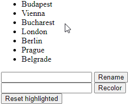

# Example test
## Studying abroad
### Lore
A group of friends decided to apply to a foreign university and study abroad. They asked their senior friends about their experience in other countries, but the older students were so *intoxicated* by all the things they learned, that their answers were really confusing.<br>
Nevertheless, the group collected all the cities where they would like to study. After hours and hours of organizing messages in their favorite chat app, they came up with the idea of programming a list for themselves.
### Task
The page should contain an undordered list, where the list items desctribe cities. If we click on an element, it should be highlighted, and if we click on it again, the highlihjz should be removed. Other elements on the page:
- An input field and a button. Pressing the button will change the content of the highlighted items to the contents of the input field.
- Another input field and button. If the input field contains the words red/green/blue, on a button press, the highlighted elements should change their color according to the input field. Any other color (or any other text that doesn't make sense as a color) should leave the items unchanged.
- A third button, which resets the higlighted elements to their original state (text and color).

### Scoring

- List items are clickable and highlightable, the second click un-highligts (2 points)
    - Half-points if the highlight works, but it cannot be removed (1.5 points)
    - Show the highlighting visually! (e.g. underline, or background-color)
    - If you use the `delegate` function and it works, you get 2 extra points (you cant go above 10)
- Pressing the first button changes the text if highlighted elements (3 points)
    - Half-points if the highlight doesn't work, but all items get rewritten 
- The second button changes the color of highlighted elements, invalid inputs don't change anything (3 points)
    - Half-points if the highlight doesn't work, but all items change color (1.5 points)
    - Half-points if the color changes to a static one regardless of input, but the highlight works (0.5 points)
    - The only valid colors are `red`, `green`, `blue`. Nothing else should work.
- The third button restores highlighted elements to their original state (2 points)
    - Half-points if the highlight doesn't work, but all items get reset (1 points)

TOTAL: 10 points (+2 for delegating)

### Example



### Induló kód
```javascript
places = [  'Budapest',
            'Vienna',
            'Bucharest',
            'London',
            'Berlin',
            'Prague',
            'Belgrade'
        ]
```